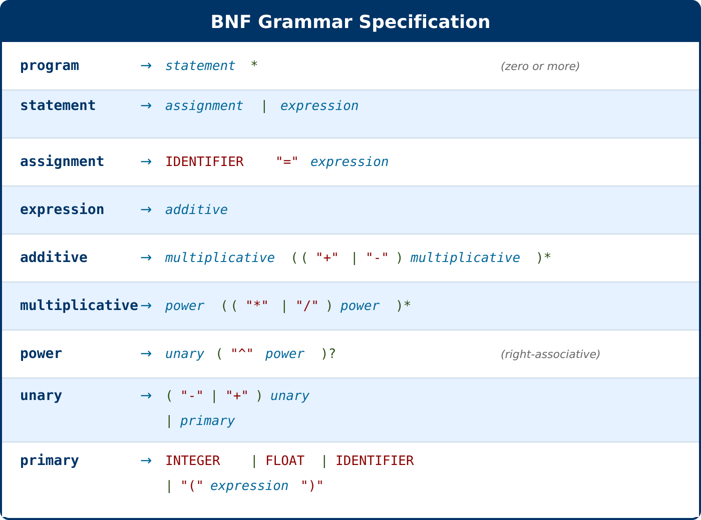
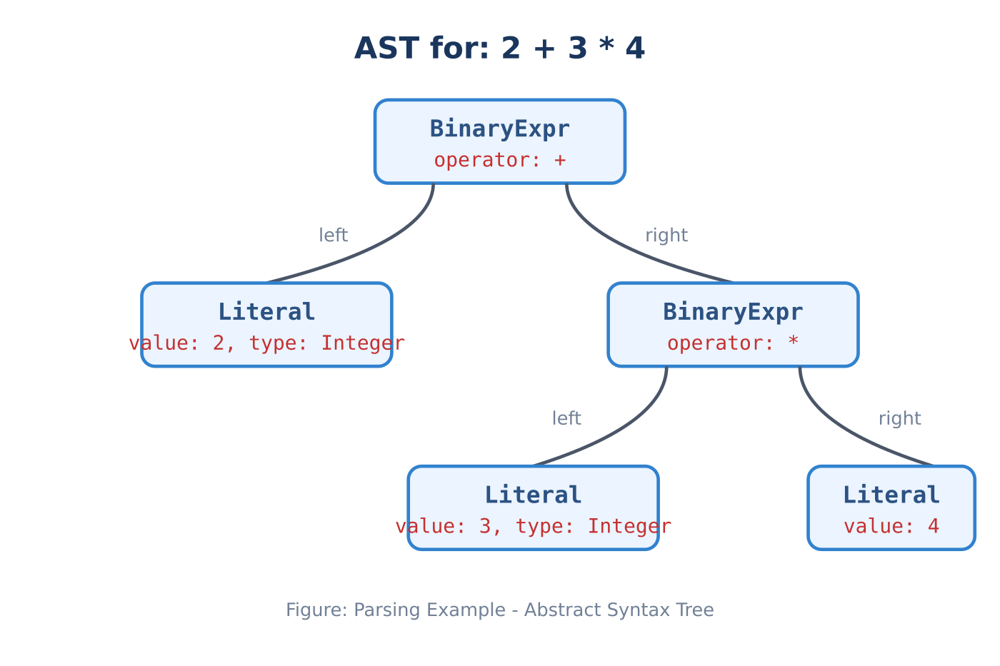

# Syntax Analysis

## What is Syntax Analysis?

Syntax analysis is the second phase of compilation. It takes the stream of tokens produced by the lexer and constructs an **Abstract Syntax Tree (AST)**—a hierarchical representation of the program's structure. This process is also known as **parsing**.

While lexical analysis answers "what are the words?", syntax analysis answers "how do the words fit together?". The parser verifies that tokens appear in a valid order according to the language's grammar and builds a tree structure that captures the relationships between expressions.

For example, given the tokens for `2 + 3 * 4`, the parser must recognize that multiplication has higher precedence than addition, producing a tree where `3 * 4` is computed first.

## Recursive Descent Parsing

The Mini Math Compiler uses **recursive descent parsing**, a top-down parsing technique where each grammar rule is implemented as a function. The parser starts from the highest-level rule (program) and recursively descends through the grammar to parse sub-expressions.

Key characteristics:
- **Top-down**: Starts from the root of the parse tree and works down
- **Predictive**: Uses lookahead to decide which production to apply
- **Direct mapping**: Each grammar rule corresponds to a parsing function

The parser also employs **precedence climbing** to handle operator precedence correctly. Each precedence level has its own parsing function, with lower-precedence operators calling higher-precedence functions for their operands.


## Grammar Specification

The Mini Math Compiler's expression language is defined by the following grammar in BNF (Backus-Naur Form) notation:



**Grammar Notation:**
- `*` means zero or more repetitions
- `?` means zero or one (optional)
- `|` means alternative choices
- Quoted strings are literal tokens
- UPPERCASE names are terminal tokens from the lexer


## Parser Algorithm (Pseudocode)

The following pseudocode illustrates the recursive descent parser with precedence climbing:

```python
function parse(tokens):
  current = 0
  statements = []
  errors = []
  
  while tokens[current].type != EOF:
    try:
      statement = parseStatement()
      statements.add(statement)
    catch error:
      errors.add(error)
      break
  
  return (statements, errors)


function parseStatement():
  # Check for assignment: IDENTIFIER = expression
  if tokens[current].type is IDENTIFIER and tokens[current+1].type is EQUALS:
    return parseAssignment()
  else:
    return parseExpression()


function parseAssignment():
  nameToken = advance()  # consume IDENTIFIER
  advance()              # consume EQUALS
  value = parseExpression()
  
  return AssignmentNode(name=nameToken.lexeme, 
                        value=value,
                        position=nameToken.position)


# Expression parsing with precedence climbing
function parseExpression():
  return parseAdditive()


# Precedence Level 1: Addition and Subtraction (left-associative)
function parseAdditive():
  left = parseMultiplicative()
  
  while tokens[current].type is PLUS or MINUS:
    operator = advance().lexeme
    right = parseMultiplicative()
    left = BinaryExprNode(operator, left, right)
  
  return left


# Precedence Level 2: Multiplication and Division (left-associative)
function parseMultiplicative():
  left = parsePower()
  
  while tokens[current].type is STAR or SLASH:
    operator = advance().lexeme
    right = parsePower()
    left = BinaryExprNode(operator, left, right)
  
  return left


# Precedence Level 3: Exponentiation (right-associative)
function parsePower():
  left = parseUnary()
  
  if tokens[current].type is CARET:
    operator = advance().lexeme
    # Right-associative: recursively call parsePower
    right = parsePower()
    return BinaryExprNode(operator, left, right)
  
  return left


# Precedence Level 4: Unary operators
function parseUnary():
  if tokens[current].type is MINUS or PLUS:
    operator = advance().lexeme
    operand = parseUnary()  # Allow chained unary operators
    return UnaryExprNode(operator, operand)
  
  return parsePrimary()


# Primary expressions (highest precedence)
function parsePrimary():
  # Integer literal
  if tokens[current].type is INTEGER:
    token = advance()
    return LiteralNode(value=token.literal, dataType=Integer)
  
  # Float literal
  if tokens[current].type is FLOAT:
    token = advance()
    return LiteralNode(value=token.literal, dataType=Float)
  
  # Variable reference
  if tokens[current].type is IDENTIFIER:
    token = advance()
    return VariableNode(name=token.lexeme)
  
  # Parenthesized expression
  if tokens[current].type is LPAREN:
    advance()  # consume '('
    expr = parseExpression()
    expect(RPAREN)  # consume ')'
    return expr
  
  error("Expected expression")


function advance():
  token = tokens[current]
  current++
  return token
```


## Operator Precedence and Associativity

Operators are parsed according to their precedence level. Higher precedence operators bind more tightly than lower precedence operators.

| Level | Operators | Description | Associativity |
|-------|-----------|-------------|---------------|
| 1 (lowest) | `+`, `-` | Addition, Subtraction | Left-to-right |
| 2 | `*`, `/` | Multiplication, Division | Left-to-right |
| 3 | `^` | Exponentiation | Right-to-left |
| 4 (highest) | unary `-`, `+` | Negation, Positive | Right-to-left |

**Associativity Examples:**

Left-associative (evaluated left to right):

$$8 - 4 - 2 \rightarrow (8 - 4) - 2 \rightarrow 2$$

$$12 \div 3 \div 2 \rightarrow (12 \div 3) \div 2 \rightarrow 2$$

Right-associative (evaluated right to left):

$$2^{3^{2}} \rightarrow 2^{(3^{2})} \rightarrow 2^{9} \rightarrow 512$$

$$-(-5) \rightarrow 5$$

**Precedence Example:**

$$2 + 3 \times 4^{2}$$

Parsed as: $2 + (3 \times (4^{2})) = 2 + (3 \times 16) = 2 + 48 = 50$


## AST Node Types

The parser produces five types of AST nodes:

### 1. Assignment Node

Represents variable assignment: `IDENTIFIER = expression`

```typescript
interface AssignmentNode {
  kind: 'Assignment';
  name: string;        // Variable name
  value: ASTNode;      // Expression being assigned
  position: Position;  // Source location
}
```

Example: `x = 42` produces:

| Field | Value |
|-------|-------|
| kind | Assignment |
| name | x |
| value | Literal(42, Integer) |

### 2. Binary Expression Node

Represents operations with two operands: `left operator right`

```typescript
interface BinaryExprNode {
  kind: 'BinaryExpr';
  operator: '+' | '-' | '*' | '/' | '^';
  left: ASTNode;       // Left operand
  right: ASTNode;      // Right operand
  position: Position;
}
```

Example: `3 + 4` produces:

| Field | Value |
|-------|-------|
| kind | BinaryExpr |
| operator | + |
| left | Literal(3) |
| right | Literal(4) |

### 3. Unary Expression Node

Represents operations with one operand: `operator operand`

```typescript
interface UnaryExprNode {
  kind: 'UnaryExpr';
  operator: '-' | '+';
  operand: ASTNode;    // The operand
  position: Position;
}
```

Example: `-5` produces:

| Field | Value |
|-------|-------|
| kind | UnaryExpr |
| operator | - |
| operand | Literal(5) |

### 4. Literal Node

Represents numeric values (integers or floats):

```typescript
interface LiteralNode {
  kind: 'Literal';
  value: number;       // Numeric value
  dataType: 'Integer' | 'Float';
  position: Position;
}
```

Examples:
- `42` → `{ kind: "Literal", value: 42, dataType: "Integer" }`
- `3.14` → `{ kind: "Literal", value: 3.14, dataType: "Float" }`

### 5. Variable Node

Represents a variable reference:

```typescript
interface VariableNode {
  kind: 'Variable';
  name: string;        // Variable name
  position: Position;
}
```

Example: `x` produces:
```json
| Field | Value |
|-------|-------|
| kind | Variable |
| name | x |


## Parsing Example

**Input Expression:**
```typescript
2 + 3 * 4
```

**Parsing Process:**

```typescript
1. parseExpression() calls parseAdditive()
2. parseAdditive() calls parseMultiplicative() for left operand
3. parseMultiplicative() calls parsePower() → parseUnary() → parsePrimary()
4. parsePrimary() matches INTEGER token 2, returns Literal(2)
5. Back in parseAdditive(): matches +, calls parseMultiplicative() for right
6. parseMultiplicative() parses 3, matches *, parses 4
7. parseMultiplicative() returns BinaryExpr(*, 3, 4)
8. parseAdditive() returns BinaryExpr(+, 2, BinaryExpr(*, 3, 4))
```

**Resulting AST:**



**AST Structure:**

| Node | Field | Value |
|------|-------|-------|
| Root | kind | BinaryExpr |
| Root | operator | + |
| Root | left | Literal(2, Integer) |
| Root | right | BinaryExpr (see below) |
| Right child | kind | BinaryExpr |
| Right child | operator | * |
| Right child | left | Literal(3, Integer) |
| Right child | right | Literal(4, Integer) |

The tree structure correctly captures that `3 * 4` should be evaluated before adding `2`, respecting operator precedence.
