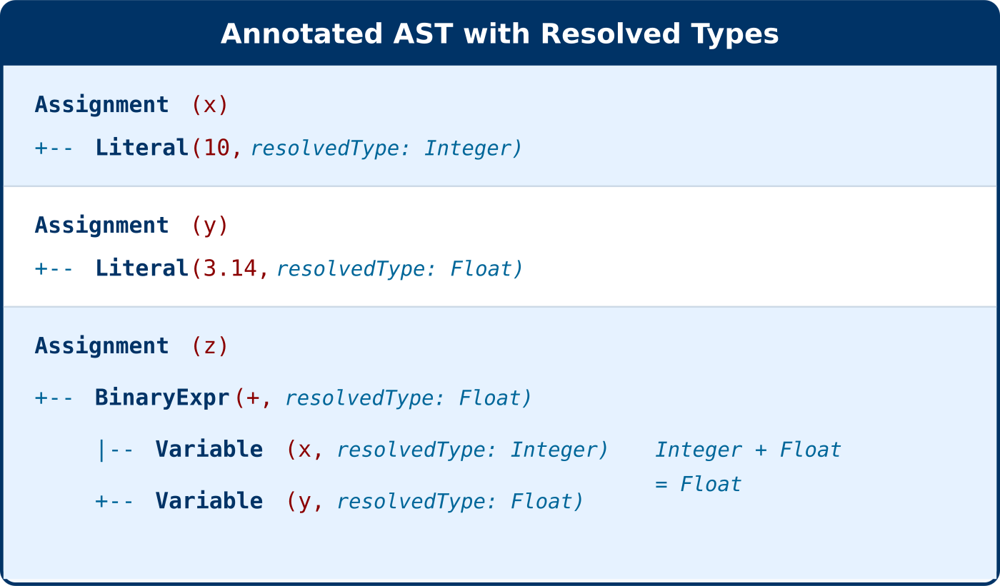

# Semantic Analysis

## What is Semantic Analysis?

Semantic analysis is the third phase of compilation, following lexical and syntax analysis. While the parser verifies that code is grammatically correct, the semantic analyzer ensures the code is **meaningful**—that operations make sense and variables are properly defined.

The Mini Math Compiler's semantic analyzer performs three key tasks:

1. **Type Inference**: Determines the data type (Integer or Float) of every expression
2. **Symbol Table Construction**: Builds a mapping of variable names to their types and definition locations
3. **Error Detection**: Identifies undefined variable references

The semantic analyzer traverses the AST produced by the parser, annotating each node with its resolved type and building the symbol table as it encounters assignments.


## Semantic Analyzer Algorithm (Pseudocode)

The following pseudocode illustrates the semantic analysis algorithm:

```python
function analyze(ast):
  symbolTable = empty Map
  annotatedAst = []
  errors = []
  
  for each node in ast:
    annotatedNode = analyzeNode(node, symbolTable, errors)
    annotatedAst.add(annotatedNode)
  
  return (symbolTable, annotatedAst, errors)


function analyzeNode(node, symbolTable, errors):
  if node.kind is Assignment:
    return analyzeAssignment(node, symbolTable, errors)
  else if node.kind is BinaryExpr:
    return analyzeBinaryExpr(node, symbolTable, errors)
  else if node.kind is UnaryExpr:
    return analyzeUnaryExpr(node, symbolTable, errors)
  else if node.kind is Literal:
    return analyzeLiteral(node)
  else if node.kind is Variable:
    return analyzeVariable(node, symbolTable, errors)


function analyzeAssignment(node, symbolTable, errors):
  # Analyze the value expression
  annotatedValue = analyzeNode(node.value, symbolTable, errors)
  valueType = getResolvedType(annotatedValue)
  
  # Add variable to symbol table
  if valueType is not null:
    symbolTable[node.name] = SymbolEntry(
      name=node.name,
      type=valueType,
      definedAt=node.position
    )
  
  return AssignmentNode(name=node.name, 
                        value=annotatedValue,
                        position=node.position)


function analyzeBinaryExpr(node, symbolTable, errors):
  # Analyze operands
  annotatedLeft = analyzeNode(node.left, symbolTable, errors)
  annotatedRight = analyzeNode(node.right, symbolTable, errors)
  
  leftType = getResolvedType(annotatedLeft)
  rightType = getResolvedType(annotatedRight)
  
  # Type promotion rules
  if leftType and rightType:
    # Division always produces Float
    if node.operator is '/':
      resolvedType = Float
    # If either operand is Float, result is Float
    else if leftType is Float or rightType is Float:
      resolvedType = Float
    # Both are Integer
    else:
      resolvedType = Integer
  else:
    resolvedType = null
  
  return BinaryExprNode(operator=node.operator,
                        left=annotatedLeft,
                        right=annotatedRight,
                        resolvedType=resolvedType,
                        position=node.position)


function analyzeUnaryExpr(node, symbolTable, errors):
  # Analyze operand
  annotatedOperand = analyzeNode(node.operand, symbolTable, errors)
  operandType = getResolvedType(annotatedOperand)
  
  # Unary operator preserves type
  return UnaryExprNode(operator=node.operator,
                       operand=annotatedOperand,
                       resolvedType=operandType,
                       position=node.position)


function analyzeLiteral(node):
  # Type is determined by dataType field from parser
  return LiteralNode(value=node.value,
                     dataType=node.dataType,
                     resolvedType=node.dataType,
                     position=node.position)


function analyzeVariable(node, symbolTable, errors):
  # Look up variable in symbol table
  entry = symbolTable.get(node.name)
  
  if entry is null:
    errors.add(Error(
      phase=semantic,
      message="Undefined variable '" + node.name + "'",
      position=node.position,
      variableName=node.name
    ))
    return VariableNode(name=node.name, position=node.position)
  
  return VariableNode(name=node.name,
                      resolvedType=entry.type,
                      position=node.position)


function getResolvedType(node):
  if node.kind is Assignment:
    return getResolvedType(node.value)
  else:
    return node.resolvedType
```


## Type System

The Mini Math Compiler supports two data types:

| Type | Description | Example Values |
|------|-------------|----------------|
| `Integer` | Whole numbers without decimal point | `42`, `0`, `-7` |
| `Float` | Numbers with decimal point | `3.14`, `0.5`, `-2.0` |

### Type Inference for Literals

The type of a literal is determined during parsing based on its lexical form:

- **No decimal point** → `Integer` (e.g., `42` is Integer)
- **Has decimal point** → `Float` (e.g., `3.14` is Float)

```typescript
// Literal node with inferred type
{
  kind: 'Literal',
  value: 42,
  dataType: 'Integer',  // Set by parser
  resolvedType: 'Integer'  // Confirmed by semantic analyzer
}
```


## Type Promotion Rules

When binary operations combine different types, the semantic analyzer applies **type promotion** rules to determine the result type:

| Left Operand | Operator | Right Operand | Result Type |
|--------------|----------|---------------|-------------|
| Integer | `+`, `-`, `*`, `^` | Integer | Integer |
| Integer | `+`, `-`, `*`, `^` | Float | Float |
| Float | `+`, `-`, `*`, `^` | Integer | Float |
| Float | `+`, `-`, `*`, `^` | Float | Float |
| Any | `/` | Any | **Float** (always) |

**Key Rules:**

1. **Mixed operands promote to Float**: If either operand is Float, the result is Float
2. **Division always produces Float**: Even $4 \div 2$ results in Float type
3. **Unary operators preserve type**: $-x$ has the same type as $x$

$$2 + 3 \rightarrow \text{Integer (both operands Integer)}$$

$$2 + 3.0 \rightarrow \text{Float (right operand is Float)}$$

$$2.0 + 3 \rightarrow \text{Float (left operand is Float)}$$

$$4 \div 2 \rightarrow \text{Float (division always Float)}$$

$$-5 \rightarrow \text{Integer (unary preserves type)}$$

$$-5.0 \rightarrow \text{Float (unary preserves type)}$$


## Symbol Table

The symbol table is a data structure that maps variable names to their type information. It is built incrementally as the semantic analyzer processes assignment statements.

### Structure

```typescript
type SymbolTable = Map<string, SymbolEntry>;

interface SymbolEntry {
  name: string;      // Variable name
  type: DataType;    // Inferred type (Integer or Float)
  definedAt: Position; // Source location of definition
}
```

### How Variables Are Added

When the analyzer encounters an assignment (`x = expression`):

1. Analyze the right-hand expression to determine its type
2. Create a symbol entry with the variable name and inferred type
3. Store the entry in the symbol table (overwrites if variable exists)

```typescript
// Processing: x = 42
symbolTable.set('x', {
  name: 'x',
  type: 'Integer',
  definedAt: { line: 1, column: 1 }
});
```

### How Variables Are Looked Up

When the analyzer encounters a variable reference:

1. Look up the variable name in the symbol table
2. If found, use the stored type as the resolved type
3. If not found, report an "undefined variable" error


## Error Detection

The semantic analyzer detects **undefined variable** errors—when code references a variable that has not been assigned a value.

### Undefined Variable Detection

When a variable reference is encountered, the analyzer checks if it exists in the symbol table. If not found, an error is recorded:

```typescript
interface CompilerError {
  phase: 'semantic';
  message: string;        // "Undefined variable 'x'"
  position: Position;     // Location of the reference
  variableName: string;   // The undefined variable name
}
```

### Example Error

```matlab
Input: y = x + 1
```

If `x` has not been previously assigned, the analyzer produces:

```typescript
{
  phase: 'semantic',
  message: "Undefined variable 'x'",
  position: { line: 1, column: 5 },
  variableName: 'x'
}
```

The analyzer continues processing after detecting an error, allowing multiple undefined variable errors to be reported in a single pass.


## Semantic Analysis Example

**Input Source Code:**
```matlab
x = 10
y = 3.14
z = x + y
```

### Step-by-Step Analysis

**Statement 1: `x = 10`**
- Analyze literal `10` → type is `Integer`
- Add to symbol table: `x → Integer`

**Statement 2: `y = 3.14`**
- Analyze literal `3.14` → type is `Float`
- Add to symbol table: `y → Float`

**Statement 3: `z = x + y`**
- Look up `x` → found, type is `Integer`
- Look up `y` → found, type is `Float`
- Apply type promotion: `Integer + Float = Float`
- Add to symbol table: `z → Float`

### Resulting Symbol Table

| Variable | Type | Defined At |
|----------|------|------------|
| `x` | Integer | line 1, col 1 |
| `y` | Float | line 2, col 1 |
| `z` | Float | line 3, col 1 |

### Annotated AST (Simplified)



Each node in the annotated AST includes a `resolvedType` field indicating the inferred type, enabling later compiler phases (such as code generation) to make type-aware decisions.
