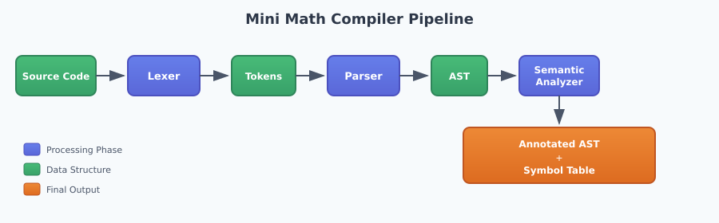
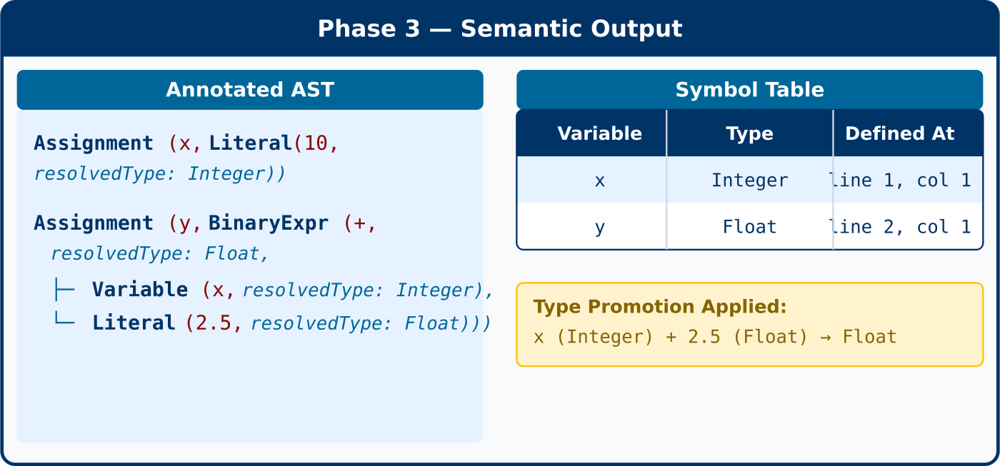

# Compilation Pipeline

## Overview

The Mini Math Compiler processes source code through three sequential phases, each transforming the input into a more structured representation. This pipeline architecture allows each phase to focus on a specific aspect of analysis while passing its output to the next phase.



## Phase Outputs

### Phase 1: Lexical Analysis (Lexer)

**Input:** Source code as a string of characters

**Output:** Array of Token objects

```typescript
interface Token {
  type: TokenType;      // INTEGER, FLOAT, IDENTIFIER, PLUS, etc.
  lexeme: string;       // The actual text from source
  position: Position;   // Line and column number
  literal?: number;     // Parsed value for numbers
}
```

**Example:**
```matlab
Input:  "x = 42 + 3.14"
Output: [IDENTIFIER(x), EQUALS, INTEGER(42), PLUS, FLOAT(3.14), EOF]
```

The lexer transforms unstructured text into a sequence of categorized tokens, discarding whitespace and tracking source positions for error reporting.

---

### Phase 2: Syntax Analysis (Parser)

**Input:** Array of Token objects from the lexer

**Output:** Array of AST nodes + parsing errors

```typescript
interface ParseResult {
  ast: ASTNode[];           // Array of statement nodes
  errors: CompilerError[];  // Syntax errors encountered
}
```

**AST Node Types:**
- `Assignment` — Variable assignment statements
- `BinaryExpr` — Operations with two operands (+, -, *, /, ^)
- `UnaryExpr` — Operations with one operand (-, +)
- `Literal` — Numeric values (Integer or Float)
- `Variable` — Variable references

**Example:**
```text
Input:  [IDENTIFIER(x), EQUALS, INTEGER(2), PLUS, INTEGER(3)]
Output: Assignment(x, BinaryExpr(+, Literal(2), Literal(3)))
```

The parser verifies grammatical correctness and builds a tree structure that captures operator precedence and expression nesting.

---

### Phase 3: Semantic Analysis

**Input:** AST nodes from the parser

**Output:** Annotated AST + Symbol Table + semantic errors

```typescript
interface SemanticResult {
  ast: ASTNode[];           // AST with resolvedType annotations
  symbolTable: SymbolTable; // Variable name → type mapping
  errors: CompilerError[];  // Semantic errors (undefined variables)
}

type SymbolTable = Map<string, {
  name: string;
  type: 'Integer' | 'Float';
  definedAt: Position;
}>;
```

**Example:**
```text
Input:  Assignment(x, BinaryExpr(+, Literal(2), Literal(3.0)))
Output: 
  - Annotated AST with resolvedType: Float (due to type promotion)
  - Symbol Table: { x → Float }
```

The semantic analyzer adds type information to every AST node and builds a symbol table mapping variables to their inferred types.


## Complete Pipeline Example

**Source Code:**
```text
x = 10
y = x + 2.5
```

**Phase 1 — Lexer Output:**
```text
[IDENTIFIER(x), EQUALS, INTEGER(10), EOF]
[IDENTIFIER(y), EQUALS, IDENTIFIER(x), PLUS, FLOAT(2.5), EOF]
```

**Phase 2 — Parser Output:**
```text
Assignment(x, Literal(10, Integer))
Assignment(y, BinaryExpr(+, Variable(x), Literal(2.5, Float)))
```

**Phase 3 — Semantic Output:**



The final output provides everything needed for code generation: a fully typed AST and a complete symbol table of all defined variables.
